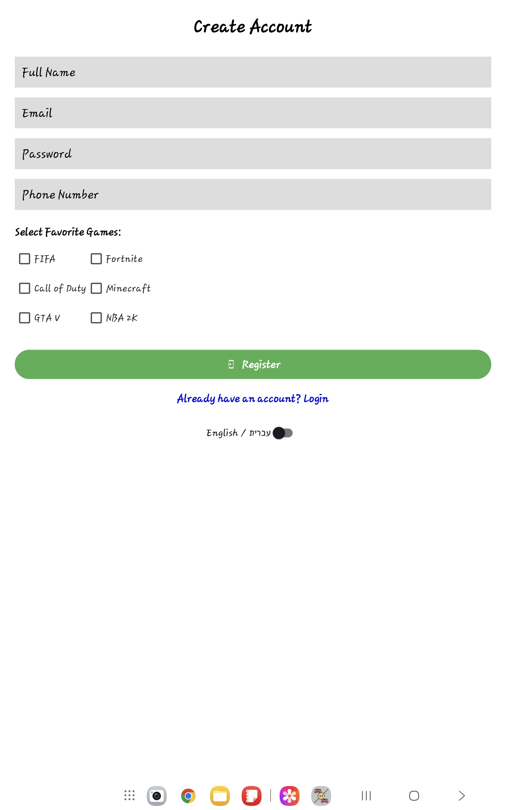
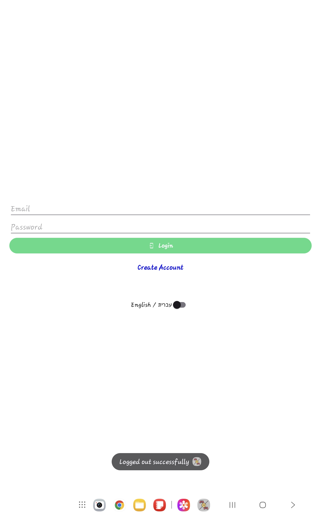
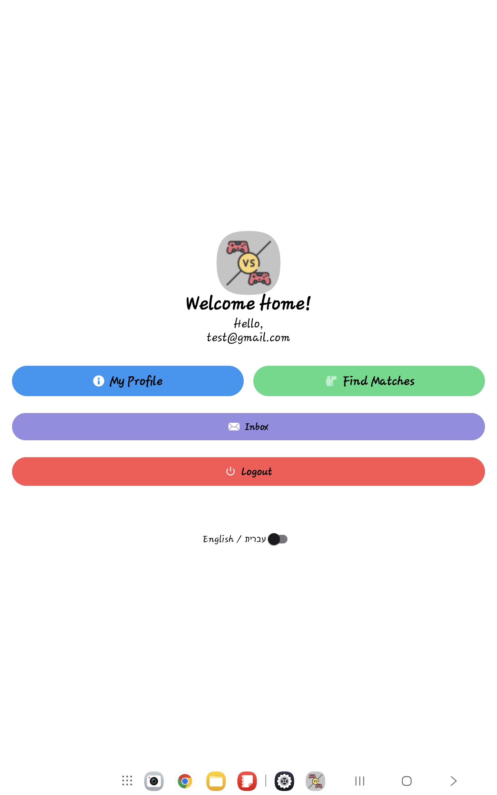
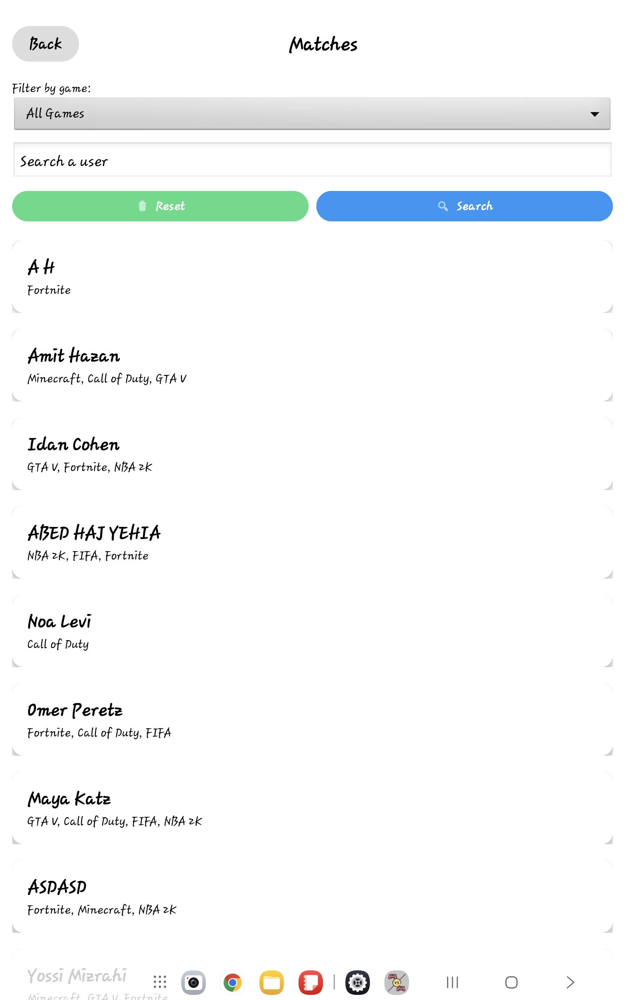
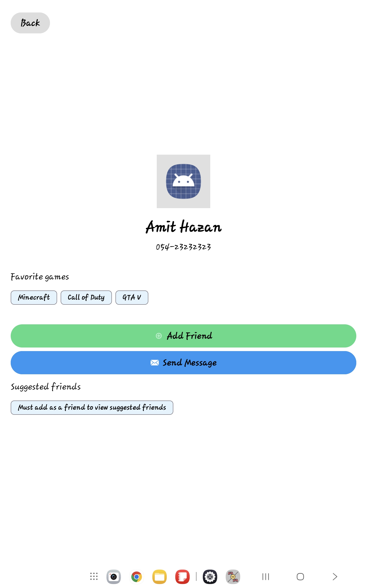

# Matchmaking Mate 🎮

**B.Sc. Computer Science Project**
**HIT - Holon Institute of Technology**

**Matchmaking Mate** is a social platform designed to connect gamers worldwide.
The goal of this project was to build a fully functional Android application that solves a real-world problem: finding the perfect gaming partner based on shared interests.

---

## 🌟 Project Overview

This application serves as a bridge between players. Unlike generic social networks, Matchmaking Mate focuses specifically on gaming preferences, allowing users to filter potential friends based on the games they play (e.g., Fortnite, FIFA, GTA V).

### Key Functionalities:
* **Smart Matching:** Filters users based on specific game selections.
* **Live Communication:** A real-time chat system powered by Firebase Realtime Database.
* **Social Graph:** Ability to send friend requests, accept/decline matches, and view profiles.
* **Secure Environment:** Full authentication system (Sign Up/Login) to ensure user privacy.

---

## 📱 App Flow & User Journey

Here is how the application works from the user's perspective:

1.  **Onboarding:** The user creates an account using their email and password. During sign-up, they select their favorite games to build their gamer profile.
2.  **Discovery:** On the home screen, the user can search for other players. The system filters the list to show relevant matches based on the selected games.
3.  **Connection:** By clicking on a user, the full profile is displayed. The user can then choose to "Add Friend".
4.  **Interaction:** Once connected, users can start a private chat, exchanging messages instantly.

---

## 🛠️ Tech Stack

This project was built to demonstrate proficiency in native Android development:

* **Language:** Java
* **IDE:** Android Studio
* **UI/UX:** XML Layouts (ConstraintLayout, RecyclerView, CardView)
* **Backend & Database (Firebase):**
    * **Firebase Authentication:** Handles secure user registration and login sessions.
    * **Firebase Realtime Database:** Stores user profiles, friendships, and chat messages with instant synchronization across devices.

---

## 📱 Screenshots

Here is a glimpse of the app's interface:

### Onboarding & Discovery
| Sign Up | Login | Matchmaking |
|:---:|:---:|:---:|
|  |  |  |

### Social & Chat
| Your Matches | Friend Profile | Chat |
|:---:|:---:|:---:|
|  |  |  |

---

### 👨‍💻 Developed By

**[Lior Mizrachi](https://github.com/Lior-Miz)**
**[Abed Haj Yehia](https://github.com/AbedHaj)**
**[Amit Hazan](https://github.com/amith372)**

*Computer Science Department*
*HIT - Holon Institute of Technology*

